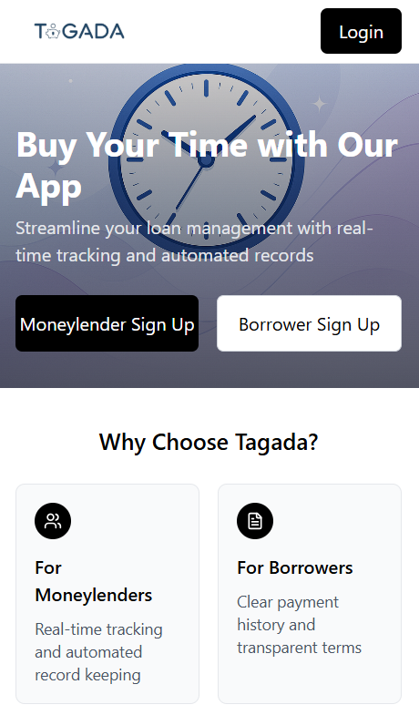
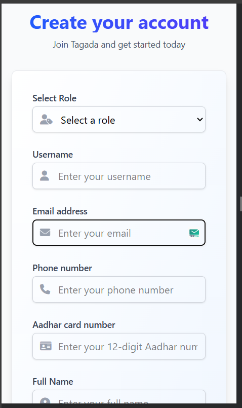
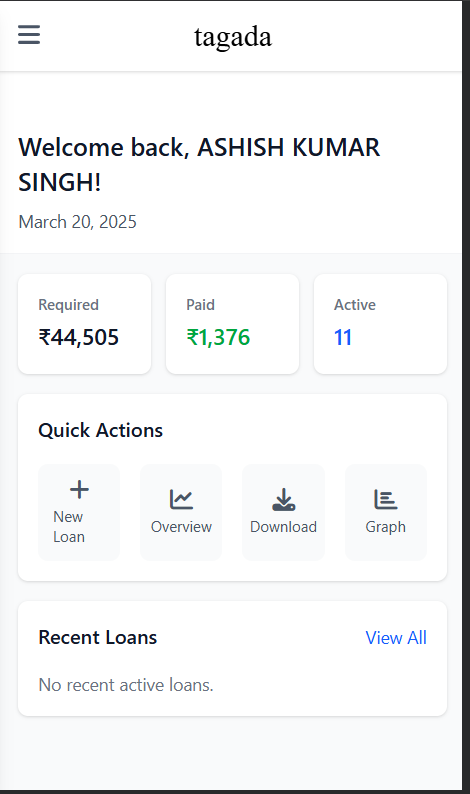
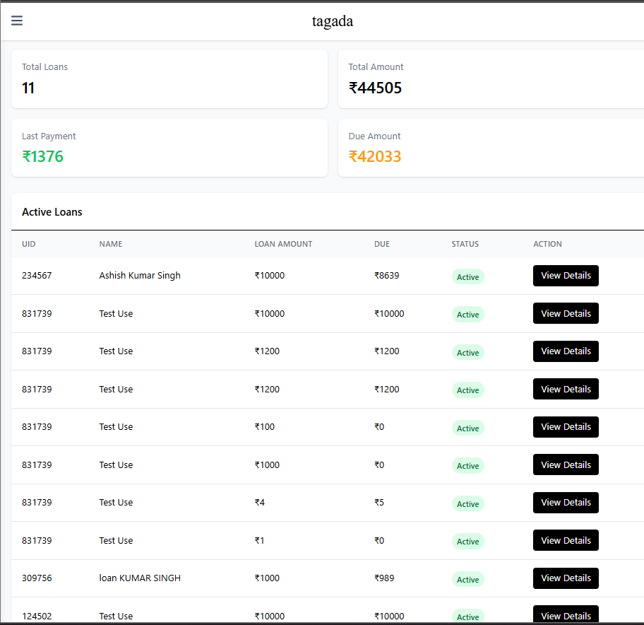
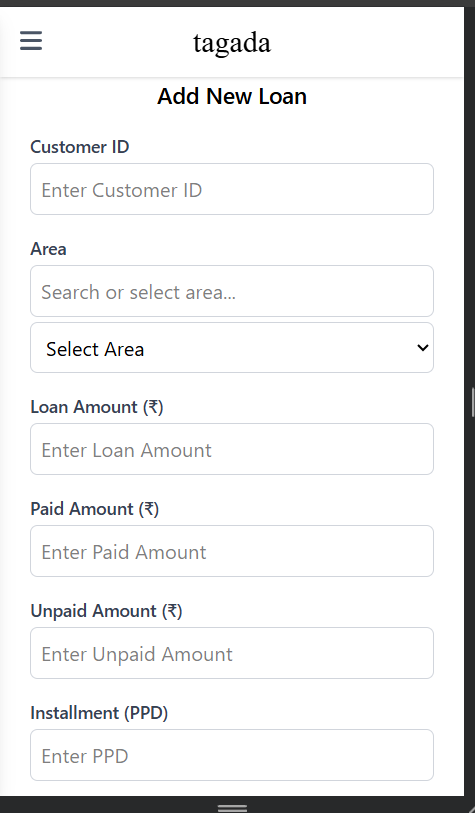
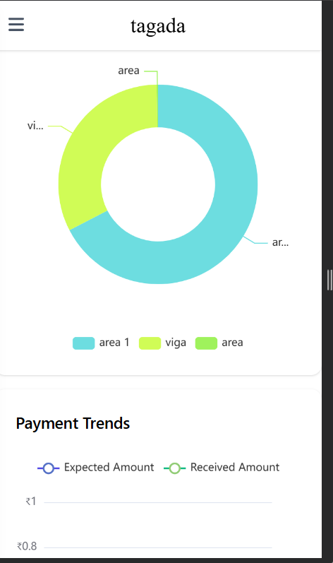
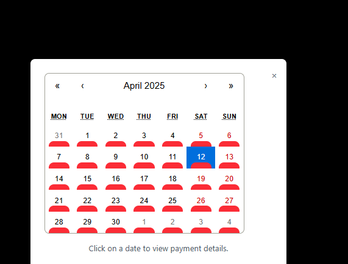
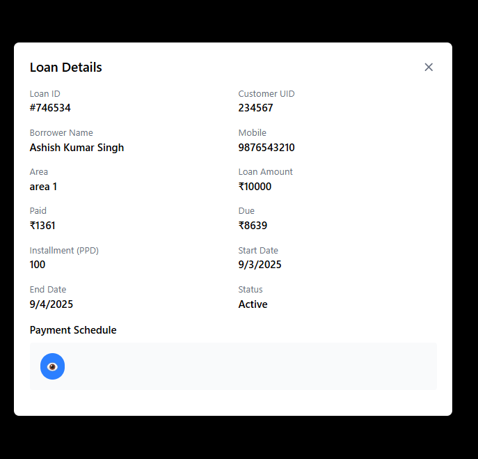
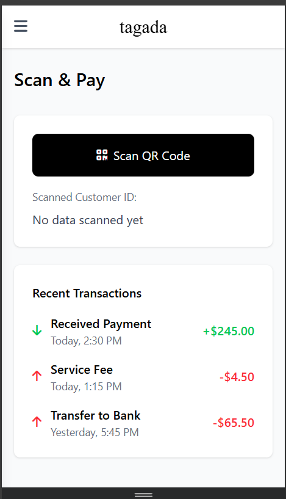

Below is the fully rewritten and consolidated `README.md` for your **Tagada: Loan Management App**, incorporating all previous updates, including the tech stack (MERN, Tailwind CSS, Redux, Redis), startup commands (`nodemon` for backend, `npm run dev` for frontend), all provided screenshots, detailed usage instructions, and the "How to Get Started" section at the bottom. The content is streamlined for clarity and completeness, ensuring it serves both developers and end-users effectively.

---

# Tagada: Loan Management App

**Tagada** is a web application designed to streamline loan management for moneylenders and borrowers. Built with the MERN stack (MongoDB, Express.js, React, Node.js), Tailwind CSS, Redux, and Redis, it offers real-time tracking, automated record-keeping, and payment management with a responsive, user-friendly interface.



## Table of Contents
- [Features](#features)
- [Tech Stack](#tech-stack)
- [Installation](#installation)
- [Usage](#usage)
- [Configuration](#configuration)
- [Contributing](#contributing)
- [License](#license)
- [Contact](#contact)
- [How to Get Started](#how-to-get-started)

## Features
- Log and manage daily loan entries with customer details and payment status.
- Track loan history, payment trends, and active loans via an intuitive dashboard.
- Role-based access for moneylenders (real-time tracking) and borrowers (transparent terms).
- Scan & Pay feature for quick transactions using QR codes.
- Visualize payment trends with charts and download reports.
- View loan details and payment schedules with a calendar interface.

## Tech Stack
- **Frontend**: React, Redux, Tailwind CSS
- **Backend**: Node.js, Express.js
- **Database**: MongoDB
- **Caching**: Redis
- **Tools**: npm, nodemon, Git

## Installation

Set up Tagada locally with the following steps:

### Prerequisites
- Node.js (v16 or higher)
- MongoDB (local or MongoDB Atlas)
- Redis (local or cloud instance)
- npm (v8 or higher)

### Steps
1. Clone the repository:
   ```bash
   git clone https://github.com/your-username/tagada-loan-app.git
   cd tagada-loan-app
   ```

2. Install backend dependencies:
   ```bash
   cd backend
   npm install
   ```

3. Install frontend dependencies:
   ```bash
   cd ../frontend
   npm install
   ```

4. Set up MongoDB:
   - Run MongoDB locally (`mongod`) or use a MongoDB Atlas URI.
   - (Optional) Seed data:
     ```bash
     cd backend
     node seed.js
     ```

5. Set up Redis:
   - Start Redis locally (`redis-server`) or connect to a cloud instance.
   - Test connection: `redis-cli ping` (should return `PONG`).

## Usage

1. **Start the Application**:
   - Start the backend:
     ```bash
     cd backend
     nodemon
     ```
     (API runs at `http://localhost:5000`.)
   - Start the frontend:
     ```bash
     cd frontend
     npm run dev
     ```
     Open `http://localhost:3000` in your browser.

2. **Sign Up**:
   - Visit the landing page
     .
   - Click "Moneylender Sign Up" or "Borrower Sign Up".
   - On the signup page
     :
     - Select your role (Moneylender or Borrower).
     - Enter username, email, phone number, Aadhaar number, and full name.
     - Submit to create your account.

3. **Log In**:
   - Return to the landing page and click "Login".
   - Use your credentials to access the dashboard.

4. **Dashboard Overview**:
   - After logging in, view your dashboard
     .
   - Check total loans (11), total amount (₹44,505), last payment (₹1,376), and due amount (₹42,033).

5. **View Active Loans**:
   - From the dashboard, see the active loans table .
   - Review loan details: UID, name, loan amount, due amount, status, and actions.
   - Click "View Details" to see individual loan information.

6. **Add a New Loan**:
   - From the dashboard, click "New Loan".
   - On the loan entry form :
     - Enter Customer ID, select Area, and input Loan Amount, Paid Amount, Unpaid Amount, and Installment (PPD).
     - Submit to save the loan.

7. **Manage Areas**:
   - Go to the menu and select "Areas".
   - On the manage areas page :
     - Search or add new areas (e.g., "viga", "area 1").
     - Use the "+" button to add more areas or "Add New Area" to save.

8. **View Payment Trends**:
   - From the menu, select "Payment Trend".
   - See the chart  showing expected vs. received amounts and area-wise distribution.

9. **Check Payment Calendar**:
   - From the menu, select "Overview" or a calendar view.
   - View the calendar .
   - Click a date (e.g., April 12) to view payment details for that day.

10. **View Loan Details**:
    - Click "View Details" on an active loan row.
    - See detailed info  including Loan ID, Customer UID, borrower name, area, paid/due amounts, and payment schedule.

11. **Scan & Pay**:
    - From the menu, select "Scan and Pay".
    - On the scan page :
      - Click "Scan QR Code" to scan a customer’s QR.
      - View scanned Customer ID and recent transactions.

## Configuration

Customize settings with environment variables:

1. **Backend**:
   Create `backend/.env`:
   ```env
   PORT=5000
   MONGO_URI=mongodb://localhost:27017/tagada
   REDIS_URL=redis://localhost:6379
   JWT_SECRET=your-secret-key
   ```

2. **Frontend**:
   Create `frontend/.env`:
   ```env
   VITE_API_URL=http://localhost:5000/api
   ```

3. **Tailwind CSS**:
   Edit `frontend/tailwind.config.js` for custom styles if needed.

## Contributing

Help improve Tagada! To contribute:

1. Fork the repository.
2. Create a feature branch:
   ```bash
   git checkout -b feature/your-feature-name
   ```
3. Commit changes:
   ```bash
   git commit -m "Add your feature"
   ```
4. Push to the branch:
   ```bash
   git push origin feature/your-feature-name
   ```
5. Open a Pull Request.

See [CONTRIBUTING.md](CONTRIBUTING.md) for guidelines.

## License

This project is licensed under the MIT License. See [LICENSE](LICENSE) for details.

## Contact

For questions or feedback:
- Email: your-email@example.com
- GitHub Issues: [Open an Issue](https://github.com/your-username/tagada-loan-app/issues)
- Twitter/X: @your-username

## How to Get Started

Once installed and running at `http://localhost:3000`:
- **Sign Up**: Choose "Moneylender" or "Borrower" on the landing page  and fill out the form .
- **Log In**: Use your credentials to access the dashboard .
- **Manage Loans**: Add new loans , view active loans , and check details .
- **Track Payments**: Use the calendar  or trends .
- **Scan & Pay**: Scan QR codes for transactions .

For detailed steps, refer to the [Usage](#usage) section above.
```

---

### How to Use This `README.md`

1. **Add Images to Your Repo**:
   - Create a `docs/screenshots/` folder in your repository.
   - Save all images with the following names:
     - `landing-page.png`
     - `signup-page.png`
     - `dashboard.png`
     - `add-loan.png`
     - `manage-areas.png`
     - `payment-trends.png`
     - `scan-pay.png`
     - `active-loans.png`
     - `payment-calendar.png`
     - `loan-details.png`
   - Upload the images:
     ```bash
     git add docs/screenshots/*
     git commit -m "Add all screenshots to README"
     git push origin main
     ```

2. **Copy and Customize**:
   - Paste the `README.md` content into a file named `README.md` in your repo’s root.
   - Replace `your-username`, `your-email@example.com`, and `tagada-loan-app` with your details.
   - Update `MONGO_URI` or `REDIS_URL` if using cloud services (e.g., MongoDB Atlas, Redis Labs).
   - Adjust any usage steps if the app flow differs.

3. **Push to GitHub**:
   ```bash
   git add README.md
   git commit -m "Consolidate and update README with all content"
   git push origin main
   ```

4. **Verify**:
   - Visit your GitHub repo to ensure all images render correctly and the content is clear.

---

### Notes

- **Structure**: The README follows a logical flow: introduction, features, tech stack, installation, usage, configuration, contributing, license, contact, and a quick start guide. The "How to Get Started" section at the bottom provides a concise entry point for users.
- **Images**: All screenshots are referenced with relative paths to `docs/screenshots/`. Ensure the folder and file names match exactly.
- **Flexibility**: If you want to adjust the placement of "How to Get Started" (e.g., after Installation), or add more sections (e.g., API docs, deployment), let me know.

---

### Next Steps
- **Implement**: Push the README and test it.
- **Feedback**: Share with peers or on X for input.
- **Enhance**: Add supporting files (e.g., `CONTRIBUTING.md`, `.gitignore`) or additional details.

Would you like me to:
- Modify the "How to Get Started" section?
- Add a Mermaid diagram for the app workflow?
- Include deployment instructions or API documentation?
- Assist with anything else (e.g., `.env` setup, license file)?

Let me know how to proceed!
