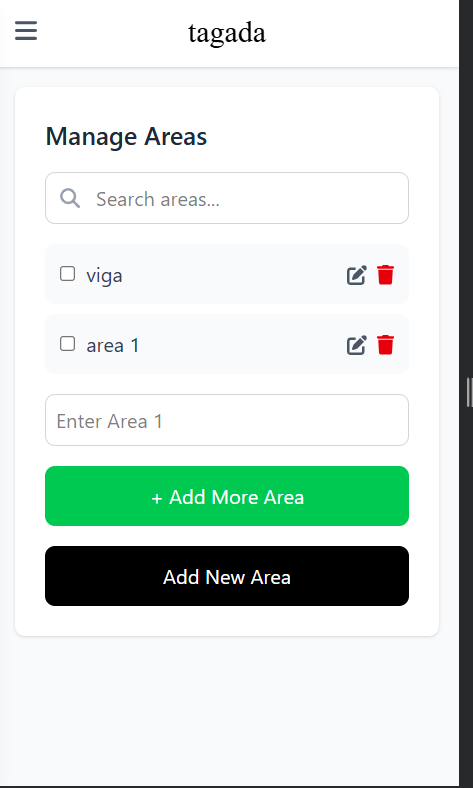

# Tagada: Loan Management App

**Tagada** is a web application that simplifies loan management for moneylenders and borrowers. Developed using the MERN stack, Tailwind CSS, Redux, and Redis, it provides real-time loan tracking, automated record-keeping, and efficient payment management. With its responsive, intuitive interface, Tagada eliminates the need for time-consuming manual daily payment entries.


*Landing page users see when accessing Tagada.*
## Live Demo

You can try the hosted version of the app here:  
🌐 [https://tagada-test.netlify.app/](https://tagada-test.netlify.app/)


## Table of Contents
- [Features](#features)
- [Tech Stack](#tech-stack)
- [Installation](#installation)
- [Usage](#usage)
- [Configuration](#configuration)
- [Contributing](#contributing)
- [License](#license)
- [Contact](#contact)
- [How to Get Started](#how-to-get-started)
- [User Manual](#user-manual)

## Features
- Log and manage daily loan entries with customer details and payment status.
- Track loan history, payment trends, and active loans via an intuitive dashboard.
- Role-based access for moneylenders (real-time tracking) and borrowers (transparent terms).
- Scan & Pay feature for quick maintain payment record using QR codes.
- Visualize payment trends with charts and download reports.
- View loan details and payment schedules with a calendar interface.

## Tech Stack
- **Frontend**: React, Redux, Tailwind CSS
- **Backend**: Node.js, Express.js
- **Database**: MySQL
- **Caching**: Redis
- **Tools**: npm, nodemon, Git

## Installation

```bash
npm install
```

Set up Tagada locally with the following steps:

### Prerequisites
- Node.js (v16 or higher)
- MongoDB (local or MongoDB Atlas)
- Redis (local or cloud instance)
- npm (v8 or higher)

### Steps

```bash
git clone https://github.com/Ashish7103/tagada-frontend.git
cd frontend
npm install
npm run dev
```

## How to Get Started {#how-to-get-started}

After setup at [http://localhost:3000](http://localhost:3000):

- Sign up using the landing page and form.  
- Log in to access the dashboard.  
- Manage loans by adding new ones, viewing active loans, and checking details.  
- Track payments with the calendar or trends.  
- Use Scan & Pay for transactions.  
- For detailed guidance, refer to the **User Manual** below.

---

## User Manual {#user-manual}

### Creating an Account

**Access the App:**  
Open your browser and go to [http://localhost:3000](http://localhost:3000). View the landing page.


*User signup page with form for both moneylenders and borrowers.*

**Sign Up:**  
Click **"Moneylender Sign Up"** or **"Borrower Sign Up"** (for loan takers). Fill the signup form with:  
- Name: Your full name  
- Email Address: A valid email  
- User ID: A unique identifier you choose  
- Aadhaar Number: Your 12-digit Aadhaar number  
- Mobile Number: Your active phone number  
- Select your role and submit

**Unique UID:**  
After submission, Tagada generates a unique 6-digit UID (e.g., 123456) for your account, displayed on your dashboard.

**Log In:**  
Return to the landing page, click **"Login"**, and use your User ID and password to access your account.

---

### For Moneylenders

**Set Up Loan Areas:**  
- Go to the menu and select **"Areas"**  
- Add areas (e.g., "viga", "area 1") where you distribute loans  
- Search or check boxes to select areas  
- Click **"+"** to add and **"Add New Area"** to save  
- This is required before issuing loans



*Manage loan distribution areas from the Areas section.*

**Create a Loan:**  
On the dashboard, click **"New Loan"**. Fill in the form:  
- UID: The 6-digit UID of the loan taker (must be a registered user)  
- Area: Select from added areas  
- Loan Amount: Total amount (principal + interest rate)  
- Paid Amount: Initially 0 (or amount paid)  
- Unpaid Amount: Calculated as Loan Amount - Paid Amount  
- Installment (PPD): Daily payment amount  
- Submit to create the loan


*Form for creating new loan entries.*

**View Loan Dashboard:**  
Redirected to the loan dashboard. Check all active loans with UID, name, amounts, status, and **"View Details"**.


*Dashboard showing all active loans.*

---

### For Loan Takers

**Access Dashboard:**  
Log in with your 6-digit UID and password. View your dashboard for loan status.


*Loan taker’s dashboard with active loan listings.*

**Check Loan Details:**  
Click **"View Details"** on the active loans table to see:  
- Paid (e.g., ₹1361)  
- Due (e.g., ₹8639)  
- Installment (e.g., PPD 100)  
- Schedule

**Track Payments:**


*Detailed view of a specific loan record.*  
Use the calendar to see due dates (e.g., April 12).


*Calendar showing upcoming and past payments.*  
Check trends for expected vs. received amounts.


*Visualization of payment collection trends.*

---

### Managing Loans

**Moneylenders:**  
Monitor loans on the dashboard and update via **"View Details"** if supported.

**Loan Takers:**  
Ensure timely payments per the schedule and contact your moneylender for adjustments.

---

### Collecting Payments

**Daily Collection:**  
As a moneylender, meet the loan taker and request their QR code.

**Scan and Record:**


*Scan QR code to update daily collections instantly.*  
- Select **"Scan and Pay"**  
- Click **"Scan QR Code"**, enter the collected amount, and submit  
- The record updates in the table and calendar

**Verify:**  
Check the dashboard to confirm the updated paid amount (e.g., last payment ₹1,376 increases).

---

### Troubleshooting

- **Login Issues:** Verify User ID and password. Reset via **"Login"** if needed.  
- **QR Scan Failure:** Ensure the QR is Tagada-generated and undamaged. Retry or request a new code.  
- **Loan Not Showing:** Confirm the loan taker’s UID is valid and registered.

---

### Contact Support

- **Email:** freespree7103ashish@gmail.com  
- **GitHub Issues:** Open an Issue  

